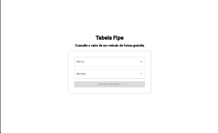

# Search for the FIPE Table

Este projeto é uma aplicação web que permite aos usuários consultar o valor de veículos utilizando a tabela FIPE de forma prática e atualizada.

## Tecnologias Utilizadas

- TypeScript
- Next.js
- React.js
- Redux
- Material-UI
- Styled Components

## Funcionalidades

- Consulta de marcas, modelos e anos de veículos.
- Exibição dos valores de veículos conforme a tabela FIPE.
- Interface responsiva e amigável.

## Captura de Tela



## 📦 Instalação

1. Clone o repositório:

```bash
git https://github.com/manuncorrea/search-for-the-fipe-table
cd search-for-the-fipe-table
```
2. Instale as dependências:

```bash
npm install
```
1. inicie o servidor:

```bash
npm install
npm run dev
```
